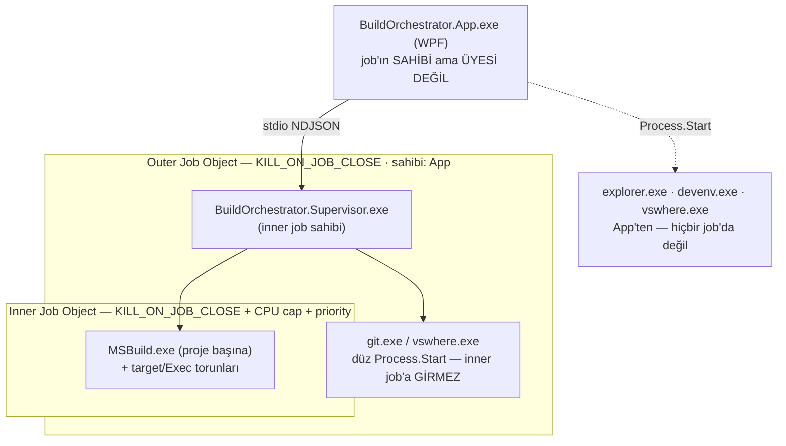

# Trust Boundary — Build Orchestrator

**Kapsam:** It-5 / D2 (v7 T17). Bu doküman, `804da6b` (branch `it5-perf-dist`) commit'indeki kodu okuyarak
uygulamanın güven sınırlarını (process, IPC, dosya sistemi, git, kullanıcı girdisi, CPU) tarif eder. Her iddia
`dosya:satır` ile atıflıdır; doğrulanamayan/eksik olan şeyler ayrı bölümde dürüstçe listelenir.

---

## 0. Çekirdek ifade

> **Orchestrator, kullanıcının Visual Studio'da zaten açacağı bir repoyu derler; güven sınırı reponun kendisidir.**

Bunun doğrudan sonucu: bir `.csproj`'daki keyfi MSBuild target'ı, `<Exec>` görevi ya da pre/post-build event'i
**kullanıcının kendi yetkisiyle kod çalıştırır** — `MSBuild.exe` bir child process olarak başlatılır
(`src/BuildOrchestrator.Core/MsBuild/MsBuildInvoker.cs:67-69`) ve MSBuild o dosyanın içindeki her şeyi yürütür.
Bu bir zafiyet değil, **ürünün tanımıdır**: aynı repoyu VS'de açmak da aynı kodu çalıştırırdı. Uygulama bu
yürütmeyi sınırlamayı hedeflemez; yalnız **kapsar** (Job Object) ve **kısar** (CPU cap).

---

## 1. Sınır haritası

| Sınır | İki taraf | Taşıyıcı | Doğrulama noktası |
|---|---|---|---|
| Process | App ↔ Supervisor ↔ MSBuild | CreateProcessW + nested Job | `JobProcessLauncher.cs:19-104` |
| IPC | App ↔ Supervisor | stdio NDJSON | `NdjsonFraming.cs:33-70`, `SupervisorHost.cs:70-74` |
| Dosya sistemi | Supervisor ↔ repo/`%LOCALAPPDATA%` | doğrudan I/O | `WorkspaceScanner.cs:18-47`, `RunLogPaths.cs:8-12` |
| Git | Supervisor ↔ kullanıcının repo'su | `git.exe` argv | `GitService.cs`, `WorktreeManager.cs` |
| Kullanıcı girdisi | UI ↔ motor | IPC komut alanları | `RunViewModel.cs:425`, `SupervisorHost.cs:81-110` |

---

## 2. Process sınırı — nested Job Object

### Kim kimi doğuruyor

| Ebeveyn | Child | Nasıl | Job üyeliği |
|---|---|---|---|
| App | Supervisor | `JobProcessLauncher.Launch(_outerJob, …)` — `EngineHost.cs:24-25` | outer job (açık `Assign`) |
| Supervisor | `MSBuild.exe` | `JobProcessLauncher.Launch(innerJob, …)` — `MsBuildInvoker.cs:68` | inner **ve** outer (nested) |
| Supervisor | `git.exe`, `vswhere.exe` | düz `Process.Start` — `ProcessRunner.cs:42` | yalnız outer (ebeveynden miras) |
| App | `explorer.exe`, `devenv.exe`, `vswhere.exe` | `Process.Start` — `OsActions.cs:47` | **hiçbir job'da değil** |

**App'in kendisi outer job'ın ÜYESİ değildir** — `EngineHost.cs:9` job'ı yaratır ama yalnız child'ı assign eder
(`JobProcessLauncher.cs:73`). Bu kasıtlı bir sonuç doğurur: App'ten açılan `devenv`/`explorer`, App kapansa bile
yaşamaya devam eder (kullanıcı Visual Studio'sunun uygulama kapanınca ölmesi kabul edilemezdi).

### Launch protokolü (kaçış penceresi yok)

`JobProcessLauncher.Launch` sırası: pipe'lar → `CreateProcessW` **CREATE_SUSPENDED** (`:40`) →
`job.Assign` hâlâ suspended iken (`:73`) → `ResumeThread` (`:83`). Yani child, job'a atanmadan önce tek bir
komut bile çalıştıramaz. Assign başarısızsa child derhal `TerminateProcess` edilir (`:77`).

Handle mirası **kısıtlıdır**: `bInheritHandles=true` yalnız redirected yolda ve yalnız
`PROC_THREAD_ATTRIBUTE_HANDLE_LIST`'teki 3 pipe ucuyla (`:53-57`). Aksi halde paralel launch'ta kardeş pipe
uçları çapraz sızar ve EOF hiç gelmezdi.

### Kim kimi öldürebiliyor

- **App → her şey:** `_outerJob.Dispose()` (`EngineHost.cs:127`) son handle'ı kapatır → `KILL_ON_JOB_CLOSE`
  (`JobObject.cs:26`, `:177`) tüm ağacı sonlandırır.
- **App → Supervisor (hedefli):** `Process.Kill(entireProcessTree: true)` (`EngineHost.cs:118`).
- **Supervisor → MSBuild ağacı:** `innerJob.Terminate()` — hard Stop (`SupervisorHost.cs:187`,
  `RunCoordinator.cs:304`); tek proje için `Kill(entireProcessTree: true)` (`MsBuildInvoker.cs:138`).
- **Supervisor App'i öldüremez.** App'in ölümü Supervisor'a stdin EOF olarak görünür → düzenli çıkış
  (`SupervisorHost.cs:53`).

### Kaskat ölüm garantisi — nerede TUTAR

- App normal kapanır (`OnExit` → `DisposeAsync` → `_outerJob.Dispose()`).
- App **çöker ya da Task Manager'dan öldürülür**: OS process handle'larını kapatır, son job handle'ı kapanır,
  kaskat işler. Managed bir parent-watcher'a ya da PID heuristiğine ihtiyaç yoktur.
- Supervisor çöker: inner job handle'ı kapanır → koşan tüm `MSBuild.exe` child'ları ölür.
- Bir child kaçmayı **deneyemez**: job `JOB_OBJECT_LIMIT_BREAKAWAY_OK` ile kurulmamıştır
  (`JobObject.cs:25-26` yalnız `KILL_ON_JOB_CLOSE` yazar), bu yüzden `CREATE_BREAKAWAY_FROM_JOB`
  `ERROR_ACCESS_DENIED` alır — bu davranış bir debug komutuyla bilinçli olarak prob edilir
  (`SupervisorHost.cs:250-256`). O komut (`debugSpawnChildren`) **varsayılan olarak kapalıdır** ve yalnız
  `--debug-hooks` ile açılır (bkz. §3); prob'u koşturan da testlerin bayrakla başlattığı Supervisor'dır.
- Kalıcı derleyici sunucuları oluşmaz: `-p:UseSharedCompilation=false -nodeReuse:false`
  (`MsBuildArguments.cs:11`) — aksi halde job dışında yaşayan bir VBCSCompiler/MSBuild node havuzu
  garantiyi anlamsız kılardı.

### Kaskat ölüm garantisi — nerede TUTMAZ

1. **App'ten başlatılan OS process'leri** (`devenv`, `explorer`, `vswhere`; `OsActions.cs:47`) hiçbir job'da
   değildir — App ölünce yaşamaya devam ederler. Bu istenen davranıştır, ama "her şey ölür" cümlesinin
   istisnasıdır.
2. **Başka bir process'e iş yaptırma.** Job üyeliği `CreateProcess` ile miras alınır; bir MSBuild target'ı
   COM/DCOM (`ShellExecute`, WMI `Win32_Process.Create`, task scheduler, zaten koşan bir servis) üzerinden
   yeni bir process açtırırsa o process **başka bir ebeveynin** çocuğu olur ve job'a hiç girmez. Kod bunu
   engelleyemez ve engellemeyi hedeflemez (bkz. §9).
3. **`--font-ab` geliştirici kabuğu**: DI kurulmaz, Supervisor hiç spawn edilmez, dolayısıyla outer job da
   yaratılmaz (`App.xaml.cs:55-60`).
4. **Cap/priority yazımının başarısızlığı garantiyi bozmaz** ama tersi bir tuzak vardır: priority yazımı
   `JOBOBJECT_EXTENDED_LIMIT_INFORMATION`'ı `KILL_ON_JOB_CLOSE` ile paylaşır. Bu yüzden yol Query → OR → Set'tir
   (`JobObject.cs:93-102`); taze bir struct yazmak limit bayrağını sessizce silerdi.

---

## 3. IPC sınırı — stdio NDJSON

### Yön ve taşıyıcı

App, Supervisor'ı redirected stdio ile başlatır (`EngineHost.cs:25`); komutlar App→stdin, event'ler
Supervisor→stdout. **Supervisor'ın stdout'u yalnız NDJSON taşır**: `Program.cs:60` daha ilk satırda
`Console.SetOut(Console.Error)` yaparak kaçak bir `Console.WriteLine`'ı stderr'e yönlendirir; Core'un tüm
uyarı/tanı kanalları da `Console.Error`'dır (`Program.cs:97`, `:118`, `:356`). Tek bir `NdjsonWriter` örneği
paylaşılır (`Program.cs:84`, `SupervisorHost.cs:93` notu) ve satır bütünlüğü writer'ın kendi semaforuyla
korunur (`NdjsonFraming.cs:11`, `:22-29`).

### App gelen mesaja ne kadar güveniyor

Deserialization sırasında **doğrulanan** şeyler:

| Kontrol | Yer | Bozuk girdide sonuç |
|---|---|---|
| Satır sınırı (1 MiB) | `NdjsonFraming.cs:9`, okuma `:59-60`, yazma `:20-21` | `IpcFramingException` |
| Yarım satır / EOF | `NdjsonFraming.cs:64` | `IpcFramingException` |
| Boş satır | `NdjsonFraming.cs:49` | tolere edilir, atlanır |
| `type` discriminator beyaz listesi | `IpcMessages.cs:17-28` (komut), `:112-132` (event) | `JsonException` |
| `null` mesaj | `NdjsonFraming.cs:53` | `IpcFramingException` |
| Framing korunur | `NdjsonFraming.cs:55` (`finally { _line.SetLength(0) }`) | satır tüketilir, akış bozulmaz |

**Bozuk/kötücül bir satır ne yapar:**

- *Supervisor tarafında* (`SupervisorHost.cs:70-74`): framing hatası **kurtarılamaz** sayılır →
  `error(framing)` yazılır ve process exit 2 ile kapanır. JSON/şema hatası ise **kurtarılabilir** →
  `error(badCommand)` yazılır, döngü devam eder (satır zaten tüketilmiştir). Tanınmayan ama geçerli bir
  discriminator zaten yoktur; tanınmayan komut tipi `error(unknownCommand)` alır (`:108`).
- *App tarafında* (`EngineHost.cs:66-78`): framing hatası kalıcı sağırlık yaratmaz — engine öldürülür,
  generation artırılır ve **tek** bir `EngineExited(null)` sinyali yayınlanır.

**Doğrulanmayan:** IPC record'ları positional parametrelidir ve `required` değildir
(`IpcMessages.cs:63-65`, `:98-99`). Eksik bir alan (`rootPath` gibi) `null` olarak bağlanır; hata ancak
planlama sırasında yüzeye çıkar — `planFailed` (`RunCoordinator.cs:694-697`) ya da genel yakalayıcıdan
`runFailed` (`RunCoordinator.cs:577-580`). Yani **hiçbir bozuk komut Supervisor'ı düşürmez**, ama alan-düzeyi
şema doğrulaması da yoktur.

### Komut yönü (App → Supervisor) hangi girdileri kabul ediyor

`SupervisorHost.DispatchAsync` (`:81-110`) tam 11 komut tanır: `ping`, `shutdown`, `startRun`, `stopRun`,
`getProjectLog`, `debugSpawnChildren`, `syncWorkspace`, `listBranches`, `listWorktrees`, `deleteWorktree`,
`setPerfMode`. **Tanınmak ≠ yürütülmek:** bunlardan `debugSpawnChildren` varsayılan olarak *reddedilir*
(aşağıdaki maddeye bakınız), yani üretim ikilisinin fiilen yürüttüğü komut sayısı 10'dur. Girdi kapıları:

- `rootPath`: `Directory.Exists` kapısı Sync'te (`SyncWorkspaceService.cs:58-62` → `planFailed`);
  Continue/RetryFailed için kanonikleştirilip aktif run'ın köküyle karşılaştırılır
  (`RunCoordinator.cs:271-280` — bozuk yol fırlatmaz, `null` döner).
- `perfMode`: ordinal beyaz liste (`PerfProfile.cs:56-62`); tanınmazsa `error(badPerfMode)`
  (`SupervisorHost.cs:194-195`).
- `deleteWorktree.name`: tek güvenli segment doğrulaması (`WorktreeManager.cs:363` → `PathSanitizer.cs:104-113`).
- `layerPatterns[].regex`: kullanıcı regex'i, 100 ms match timeout ile derlenir (`LayerEngine.cs:49`, `:59-60`).
- `debugSpawnChildren`: bir **test kancasıdır ve varsayılan olarak KAPALIDIR**. Komut tanınmaya devam eder
  (tip + `debugSpawnChildren` ayrımcısı `IpcMessages.cs:22`/`:36`'da durur — IPC sözleşmesi kırılmadı), ama
  Supervisor `--debug-hooks` ile başlatılmadıysa `error(debugHooksDisabled)` ile **reddedilir**
  (`SupervisorHost.cs:242-243`). Bayrağın adının tek sahibi `SupervisorHost.DebugHooksArg` (`:47`);
  ayrıştırması `Program.cs:79`, host'a bağlanması `:102`. Bayrak verildiğinde komut eskisi gibi `cmd.exe`
  üzerinden `Start-Sleep` çocuğu doğurur (`SupervisorHost.cs:250-252`).
  **App bayrağı hiç göndermez** — `EngineHost` Supervisor'ı argümansız başlatır (`EngineHost.cs:71`), yani
  kullanıcının çalıştırdığı ikilide bu kanca ölüdür; onu yalnız testler açar.
  **Bu bir güvenlik sınırı DEĞİL, bir yüzey daraltmasıdır:** erişim zaten yalnız Supervisor'ın stdin'ini
  tutabilen için mümkündü (yani App'in yerinde olan biri için — §10). Değişen şey, **varsayılan yüzeyin
  daralmasıdır**.

---

## 4. Dosya sistemi sınırı

### Okunan yollar

| Ne | Nerede | Not |
|---|---|---|
| `*.csproj`, `*.sln` (rekürsif) | `WorkspaceScanner.cs:18-47` | `.git`/`bin`/`obj`/`node_modules`/`.vs` atlanır (`:15-16`); `_wpftmp.csproj` elenir (`:37`) |
| csproj ham XML | `CsprojEvaluator.cs:37` | MSBuild **çalıştırılmaz**; `Compile`/`Reference`/`ProjectReference` ham okunur |
| `.sln` metni | `SolutionMapper.cs:29` + regex `:14` | `Project(...)` satırlarından csproj göreli yolları |
| `obj/project.assets.json` | `StaleObjDetector.cs:36-37` | **yalnız teşhis**; hiçbir dosyaya dokunulmaz (`:51-53` bozuk JSON'da bile) |

### Yazılan yollar

| Ne | Yer | Dayanıklılık |
|---|---|---|
| Run logları | `%LOCALAPPDATA%\BuildOrchestrator\logs\run-<ts>\` — `RunLogPaths.cs:8-12`, `RunLogWriter.cs:22-24` | proje başına dosya adı = SHA256'nın ilk 16 hex'i (`ProjectLogNaming.cs:9-13`) |
| `build-state.json` | `<cacheRoot>\build-state.json` — `BuildStateStore.cs:20` | atomik temp+rename (`:79-83`), bozuk dosya asla fırlatmaz (`:50-53`) |
| `evaluation-cache.json` | `Program.cs:114` | atomik temp+rename, IO hatası yutulur (`EvaluationCache.cs:89-105`) |
| `ui-state.json` | `%LOCALAPPDATA%\BuildOrchestrator\ui-state.json` — `UiStateStore.cs:100-102` | bozuk dosya varsayılana düşer (`:111-114`) |
| Worktree havuzu | `%LOCALAPPDATA%\BuildOrchestrator\worktrees\` — `WorktreeManager.cs:123-124` | 20 GiB cap + LRU budama (`Program.cs:54`, `WorktreeManager.cs:331-358`) |
| Branch sidecar | `<worktree>\.bo-worktree-branch.txt` — `WorktreeManager.cs:109`, `:195` | best-effort; yazılamazsa build etkilenmez |
| Autostart | `HKCU\Software\Microsoft\Windows\CurrentVersion\Run` — `AutostartService.cs:26-31` | HKLM/admin **gerekmez** |

`--logs` verildiğinde cache/state de onun yanına taşınır (`Program.cs:66-69`) ve `--worktrees` havuz kökünü
değiştirir (`:73`) — testlerin kullanıcının gerçek verisine dokunmamasının mekanizması budur.

### `BaseIntermediateOutputPath` izolasyonu

Worktree modunda her projenin `obj`'i **proje Id'si (tam csproj yolu)** anahtarıyla ayrılır:
`WorktreeObjPathResolver.Resolve` = `<worktreeRoot>\_obj\<SHA256(lower(projectId))[0..8]>`
(`WorktreeObjPathResolver.cs:29-38`), MSBuild'e `-p:BaseIntermediateOutputPath=` olarak geçer
(`MsBuildArguments.cs:14-15`), bağlanma noktası `RunCoordinator.cs:969-970`.

**Garanti ettiği:** iki farklı projenin aynı `obj` klasörünü paylaşması yapısal olarak imkânsızdır (SPIKE ile
kanıtlanmış "bayat obj zehri" — `WorktreeObjPathResolver.cs:7-12`). Hash girdisi lower-invariant olduğu için
aynı projenin farklı case'li yol string'leri aynı klasöre düşer (Windows FS case-insensitive).
**Garanti etmediği:** obj içeriğinin doğruluğu; bu yalnız bir *ayrıştırma* mekanizmasıdır.
In-place build bu sınıfı hiç çağırmaz (VS-parity, varsayılan `obj`).

### §4 — OutDir'e DOKUNULMAZ

`MsBuildArguments.Build` (`:6-17`) `-p:OutDir` ya da `-p:OutputPath` **yazmaz**; tüm kaynak ağacında da böyle
bir argüman üretilmez (grep: yalnız `BaseIntermediateOutputPath` geçer). Sonuç: derleme çıktısı, kullanıcının
solution'ının kendi ortak `OutDir`'ine VS ile birebir aynı şekilde düşer. Simetrik olarak "değişti mi" kararı
**hiçbir zaman** DLL/bin timestamp'ı okumaz — `Core` içinde çıktı ikililerine ait tek bir `LastWriteTime`
okuması yoktur (yalnız `EvaluationCache.cs:44` csproj mtime'ı ve `WorktreeManager.cs:460-467` havuz LRU'su);
karar kaynağı git'in kendi committed blob SHA'ları + dirty listesidir (`Program.cs:298-310` özeti).

---

## 5. Git sınırı — K1: salt-okur

Kaynak ağacında `git.exe`'ye giden **tüm** argüman dizileri (tam liste):

| Komut | Yer | Mutasyon? |
|---|---|---|
| `rev-parse --verify -q HEAD` | `GitService.cs:83` | hayır |
| `symbolic-ref --short -q HEAD` | `GitService.cs:107` | hayır |
| `status --porcelain` | `GitService.cs:123` | hayır |
| `rev-parse --is-shallow-repository` | `GitService.cs:135` | hayır |
| `for-each-ref --format=… refs/heads refs/remotes` | `GitService.cs:149` | hayır |
| `rev-parse --verify -q refs/remotes/origin/<branch>` | `GitService.cs:222` | hayır |
| `rev-parse --verify -q refs/heads/<branch>` | `GitService.cs:250` | hayır |
| `ls-tree -r HEAD` | `GitService.cs:306` | hayır |
| `worktree list --porcelain` | `WorktreeManager.cs:387` | hayır |
| `fetch origin <branch> --no-tags` | `GitService.cs:196` | **yalnız `refs/remotes/*`** |
| `worktree add --detach <path> <sha>` | `WorktreeManager.cs:187` | ana repoda yalnız worktree kaydı |
| `worktree remove --force <path>` | `WorktreeManager.cs:367` | havuz worktree'sini siler |
| `reset --hard <sha>` | `WorktreeManager.cs:297` | **cwd = havuz worktree'si**, ana repo değil |

**`checkout`, `switch`, `pull`, `merge`, `rebase`, `cherry-pick`, `stash`, `clean` hiçbir yerde yoktur.**

### Kullanıcının çalışma ağacı neden güvende

1. Aktif branch hiçbir kod yolunda checkout edilmez; farklı bir branch'i derlemenin **tek** mekanizması
   ayrı bir worktree'dir (`Program.cs:133-160`). Worktree hazırlanamazsa ve seçili branch aktif branch'ten
   farklıysa run **hiç başlamaz** (`WorktreePreparationException` → `planFailed`, `Program.cs:155-159`) —
   sessizce yanlış (kirli) ağacı derlemek yerine durmak tercih edilir.
2. Worktree'ler daima `--detach` ile açılır (`WorktreeManager.cs:187`): hiçbir branch ref'i bir worktree'ye
   bağlanmaz, dolayısıyla havuzdaki bir işlem kullanıcının branch'ini oynatamaz.
3. Tek yıkıcı komut olan `reset --hard` üç kapıdan geçer: (a) aday yollar git'in **kendi**
   `worktree list --porcelain` çıktısından gelir ve havuz kökü altında olmayanlar elenir
   (`WorktreeManager.cs:393-398`); (b) seçilen yol ana repo köküne eşitse reddedilir (`:287-288` — junction
   savunması); (c) o worktree'nin HEAD'i **detached değilse** reddedilir (`:291-295`), çünkü attached bir
   HEAD'e reset atmak bir branch ref'ini oynatırdı.
4. `fetch` yalnız remote-tracking ref'i günceller ve `--no-tags`'tir; başarısız olursa **yutulur** —
   hedef SHA yerel HEAD'e düşer, akış degrade modda devam eder (`GitService.cs:194-213`,
   `SyncWorkspaceService.cs:74-81`).

**Kullanıcının göreceği tek veri kaybı riski:** havuzdaki bir worktree'yi editörde açıp elle değiştirirse,
bir sonraki yeniden kullanımdaki `reset --hard` o değişiklikleri sessizce atar (`WorktreeManager.cs:252-257`
bunu açıkça belgeler). Havuz, uygulamanın kendi scratch alanıdır.

---

## 6. Kullanıcı girdisi ve argüman enjeksiyonu

| Girdi | Kaynak | Nereye gider | Enjeksiyon riski |
|---|---|---|---|
| Repo kökü | `OpenFolderDialog` (`OsActions.cs:133-138`) veya Settings (`RunViewModel.ActionBar.cs:125-137`) | `StartRunCommand.RootPath` (`RunViewModel.cs:425`) → `ProcessSpec.WorkingDirectory` (`GitCommandExecutor.cs:22` → `ProcessRunner.cs:29`) | **Yok** — argüman değil, çalışma dizini |
| Proje/solution yolları | disk taraması | `WindowsCommandLine.Build` ile MSBuild komut satırı (`MsBuildInvoker.cs:67`) | **Yok** — MSVCRT-uyumlu kaçış (`WindowsCommandLine.cs:16-28`) |
| Branch | branch listesi (`RunViewModel.ActionBar.cs:45-47`) ya da `ui-state.json` | `git fetch origin <branch>` argv elemanı | **Düşük** — bkz. §8/4 |
| PerfMode | perf chip | ordinal beyaz liste (`PerfProfile.cs:56-62`) | **Yok** |
| Worktree adı | UI / `ui-state.json` | `PathSanitizer.IsSafeSegment` (`WorktreeManager.cs:363`) | **Yok** |
| Layer regex | Settings editörü | `Regex` ctor + 100 ms timeout (`LayerEngine.cs:59-60`) | ReDoS **kapalı** (bkz. §8) |
| VS seçimi (Open in VS) | satır ikonları | `devenv "<sln>"` — elle tırnaklama (`OsActions.cs:127`) | **Teorik** — bkz. §8/3 |

**Neden git/MSBuild tarafında risk yok:** `ProcessRunner` argümanları `psi.ArgumentList`'e tek tek ekler
(`ProcessRunner.cs:39` — "elle string birleştirme YASAK"), `UseShellExecute=false`'tur (`:36`) ve hiçbir yerde
`cmd.exe`/`powershell` bir aracı olarak kullanılmaz (tek istisna, **varsayılan olarak kapalı** olan
`debugSpawnChildren` test kancasıdır — yalnız `--debug-hooks` ile açılır, bkz. §3;
`SupervisorHost.cs:250-251`). Kabuk devrede olmadığı için `&`, `|`, `;`, `` ` `` gibi metakarakterlerin bir
anlamı yoktur; MSBuild yolunda ise komut satırı elle kurulur ama kaçış `WindowsCommandLine` ile
CreateProcessW/MSVCRT kurallarına göre yapılır (backslash-tırnak sayımı dahil, `:23-27`).

---

## 7. CPU / kaynak sınırı

**Neyi sınırlar.** Perf profili tablosu: `Full(6, cap yok, Normal)` · `Balanced(4, %70, BelowNormal)` ·
`Light(2, %40, Idle)` (`PerfProfile.cs:30-35`). Cap, `JOB_OBJECT_CPU_RATE_CONTROL_ENABLE | HARD_CAP` ile
yazılır (`JobObject.cs:117-123`) ve **makinenin toplam CPU'sunun yüzdesi** olarak job'daki tüm process'lerin
**toplamına** uygulanır. Priority ise job'daki tüm process'lerin priority class'ını tavanlar
(`JobObject.cs:82-103`). İkisi de **yalnız inner job'a** yazılır: `RunCoordinator.cs:116`
(`_cpu = cpuGovernor ?? innerJob`) ve gerekçesi `RunCoordinator.cs:88-95` — outer job'a yazmak Supervisor'ı,
dolayısıyla IPC'yi de kısardı.

**Neyi sınırlamaz.**

1. **git ve vswhere.** Bunlar `ProcessRunner` üzerinden düz `Process.Start` ile doğar (`ProcessRunner.cs:42`)
   ve inner job'a **hiç assign edilmez** — bu, kodda açıkça belgelenmiş bir tasarım kararıdır
   (`ICpuGovernor.cs:12-15`). Ebeveynlerinden (Supervisor) outer job üyeliğini miras alırlar, yani kaskat
   ölüm onları kapsar; ama inner job'un cap'i onlara **uygulanmaz**. Sonuç: `Light` modda bile Sync
   (fetch/status/ls-tree), branch listesi ve MSBuild çözümü tam hızda koşar — kullanıcı arayüzü cap
   yüzünden yavaşlamaz. Kısılan yalnız derlemedir.
2. **App'in kendisi** hiçbir job'da değildir (§2) — UI thread'i, render ve konsol batching cap dışıdır.
3. **Bellek, disk I/O, ağ, process sayısı, iş parçacığı**: hiçbir job limiti yazılmaz — `JobObject`'in yazdığı
   tek şeyler `KILL_ON_JOB_CLOSE`, priority class ve CPU rate'tir (`JobObject.cs:19-35`, `:82-123`).
4. **Copy-contention penceresi cap'i geçici olarak gevşetir.** Post-build copy MSB302x'e takıldığında cap ve
   priority `Balanced` tabanına (%70 / BelowNormal) çekilir (`RunCoordinator.cs:413-442`, `:450-467`;
   taban `PerfProfile.cs:44`, `:52`), pencere ref-count'ludur. Yani `Light` modda ölçülen gerçek CPU tavanı
   geçici olarak %40 değil %70 olabilir.
5. **Graceful drain'den sonra cap bir daha yazılmaz, priority de taban değerin altına indirilemez**
   (`RunCoordinator.cs:143-146`; `EffectiveCapLocked` ve `EffectivePriorityLocked` AYNI `CapWritableLocked`
   predicate'ine bağlıdır): "torn DLL yok" garantisi, sonradan geri konan bir cap ya da drain sürerken `Idle`'a
   düşürülen bir priority ile pazarlık edilmez. Nötrleme iki tarafta farklı yönde okunur — cap için "cap yok",
   priority için "tabandan (BelowNormal) kötü değil"; istenen priority zaten tabandan iyiyse (`Full`'ün
   `Normal`'i) aynen korunur.
6. Cap/priority yazımı bir **optimizasyondur**: Win32 hatası run'ı öldürmez, yalnız stderr'e uyarı düşer
   (`RunCoordinator.cs:519-534`) ve `runStarted.cpuCapPercent` istenen değil **yürürlükteki** değeri taşır
   (`IpcMessages.cs:145-150`).

---

## 8. Sertleştirilmiş yüzeyler (kanıtla)

1. **Kullanıcı regex'i — ReDoS.** Her layer pattern'i 100 ms `matchTimeout` ile derlenir
   (`LayerEngine.cs:49`, `:59-60`). Timeout'a giren pattern non-match sayılır ve kalan tüm node'lar için
   atlanır (`:104`, `:107-112`); kullanıcıya warn-only bir satır çıkar (`:120-123`). Boş/whitespace pattern
   "her şeyle eşleşir" tuzağına düşmez, inert'e çevrilir (`:88`, `:100`).
2. **NDJSON 1 MiB satır sınırı** hem yazımda hem okumada uygulanır (`NdjsonFraming.cs:9`, `:20-21`, `:59-60`);
   log chunk'ları 64 K olduğu için meşru trafik bu tavanın çok altındadır.
3. **Branch slug sanitization** (`PathSanitizer.cs:28-59`): `/`, `\`, `: * ? " < > |` ve kontrol karakterleri
   `-`'ye çevrilir, ardışık tireler tekilleştirilir; sonuç boş ya da `.`/`..` ise **fallback yerine hata**
   fırlatılır. Ayrı bir salt-validator (`:104-113`) mutlak yolu, ayracı ve `..`'yı reddeder.
4. **Atomik state yazımı**: `build-state.json` ve `evaluation-cache.json` benzersiz temp adına yazılıp
   `File.Move(overwrite:true)` ile yerine konur (`BuildStateStore.cs:79-83`, `EvaluationCache.cs:92-97`);
   okuyucu `FileShare.Delete` verir ki yazıcının rename'ini bloklamasın (`BuildStateStore.cs:105-110`),
   rename geçici sharing-violation'da sınırlı retry'lanır (`:120-138`).
5. **Bozuk-JSON toleransı**: `build-state.json` (`BuildStateStore.cs:50-53`), `evaluation-cache.json`
   (`EvaluationCache.cs:117`), `ui-state.json` (`UiStateStore.cs:111-114`), `project.assets.json`
   (`StaleObjDetector.cs:51-53`) — hepsi bozuk dosyada varsayılana düşer, hiçbiri uygulamayı düşürmez.
   `ui-state.json`'da ayrıca tip değişmiş eski bir alan tüm dosyayı devirmesin diye toleranslı converter
   vardır (`UiStateStore.cs:64-84`).
6. **Log satırı normalizasyonu**: gömülü CR/LF tek boşluğa çevrilir, böylece bir `AppendLine` = tam bir
   fiziksel satır (`RunLogWriter.cs:96-97`) — MSBuild'in ürettiği garip bir satır dikişi bozamaz.
7. **Single-instance kanalı** oturum-yerel mutex + oturum id'si katılmış named pipe'tır
   (`SingleInstance.cs:39`, `:73`); pipe meşgulken spin yerine geri çekilme uygulanır (`:142-149`).

---

## 9. Kodun GERÇEKTEN doğrulamadıkları (dürüst liste)

1. **csproj `Include`'u repo kökünün dışına çıkabilir.** `ProjectReference`/`Compile` değerleri
   `Path.Combine(dir, v)` + `GetFullPath` ile çözülür (`CsprojEvaluator.cs:70-74`, `:104`); `..\..\` ile
   repo dışına işaret eden bir yol reddedilmez. Sonuç: graf/imza repo dışı bir dosyayı kaynak sayabilir.
   Kabul edilen risk — repo zaten güvenilir (§0).
2. **Symlink/junction takip edilmez.** `WorkspaceScanner.Walk` (`:42-46`) `Directory.EnumerateDirectories`
   ile ilerler; reparse point kontrolü yoktur. Kendine dönen bir junction sonsuz rekürsiyona/derin yola yol
   açabilir. (Havuz tarafında en azından `reset --hard` için ayrı bir junction kapısı vardır —
   `WorktreeManager.cs:283-288`.)
3. **`explorer`/`devenv` argümanları elle tırnaklanır.** `OsActions.cs:111` ve `:127` `$"\"{path}\""`
   kurar; içinde `"` geçen bir yol kaçışı bozardı. Pratikte erişilmez (Windows dosya adları `"` içeremez ve
   yollar disk taramasından gelir) ve `UseShellExecute=false` olduğu için kabuk devrede değildir — yine de
   `WindowsCommandLine` kullanılmayan iki yerdir.
4. **Branch adı git'e opsiyon olarak sızabilir (teorik).** `Branch`, UI'da yalnız listeden seçilir
   (`RunViewModel.ActionBar.cs:45-47`) ama `ui-state.json`'dan da yüklenir (`MainWindow.xaml.cs:102`).
   Elle düzenlenmiş bir dosyada `-`'la başlayan bir değer `git fetch origin <branch>` argv'sine olduğu gibi
   girerdi (`GitService.cs:196`) — `--` ayracı ya da ön-doğrulama yoktur. Erişim için saldırganın zaten
   kullanıcının hesabında olması gerekir.
5. **Supervisor argümanları doğrulanmaz.** `--logs` (`Program.cs:62`) ve `--worktrees` (`:73`) ham alınır,
   `Directory.CreateDirectory` ile oluşturulur; `--debug-hooks` (`:79`) ise değer almayan bir bayraktır ve
   yalnız varlığına bakılır. App bunların **hiçbirini göndermez** (`EngineHost.cs:71` argümansız başlatır);
   yalnız testler kullanır.
6. **IPC alan-düzeyi şema doğrulaması yoktur** (bkz. §3): eksik/`null` alanlar ancak kullanım noktasında
   patlar ve `planFailed`/`runFailed`'a dönüşür.
7. **`debugSpawnChildren` üretim derlemesinden KALDIRILMADI, bir bayrağın arkasına alındı**
   (`SupervisorHost.cs:95-96`, `:240-259`): tip ve JSON ayrımcısı yerinde durur, komut varsayılan olarak
   `error(debugHooksDisabled)` alır ve yalnız `--debug-hooks` ile açılır. **Kalan yüzey:** Supervisor'ı
   başlatan taraf bayrağı da geçirebilir — ama o taraf zaten App'in kendisidir (§10), yani bu bir sınır
   değil yüzey daraltmasıdır. Bayrak da, diğer Supervisor argümanları gibi, doğrulanmaz (madde 5).
8. **Havuz worktree'sindeki elle yapılmış değişiklikler korunmaz** (§5 sonu).

---

## 10. Tehdit modeli DIŞI (ne korunmuyor)

Bu bir **geliştirici aracıdır**; kullanıcının kendi makinesinde, kendi yetkisiyle, kendi kodunu derler.
Aşağıdakiler açıkça tehdit modeli dışıdır:

- **Kötücül `.csproj` / MSBuild target / `<Exec>` / pre-post-build event.** Bunlar kullanıcı yetkisiyle
  keyfi kod çalıştırır (`MsBuildInvoker.cs:67-69`). Uygulama bunu sandbox'lamaz, denetlemez, izin sormaz.
  Repoyu VS'de açmak da aynı sonucu doğururdu. Job Object bu kodu **hapsetmez**, yalnız yaşam döngüsünü
  ebeveyne bağlar ve CPU'sunu tavanlar.
- **Job'dan kaçış.** COM/DCOM/WMI/task-scheduler üzerinden başka bir ebeveyne iş yaptıran bir build adımı
  job dışında process açtırabilir (§2, madde 2). Buna karşı savunma yoktur.
- **Kötücül `.sln` / `packages.config` / NuGet paketi.** `-t:restore` (`MsBuildArguments.cs:20-24`)
  paketleri indirir ve build target'larını çalıştırır; paket içeriği denetlenmez.
- **Yerel dosya sistemine erişimi olan bir saldırgan.** `ui-state.json`, `build-state.json`,
  `evaluation-cache.json` ve `HKCU\...\Run` düz metindir ve imzalanmaz; kullanıcı hesabına sahip biri bunları
  değiştirebilir. Aynı kişi zaten `.csproj`'u da değiştirebilirdi.
- **Supervisor'ın stdin'ini ele geçirebilen biri.** IPC'de kimlik doğrulama yoktur (anonim pipe, ebeveyn-child
  mirası) — bu, App'in yerinde olmakla eşdeğerdir.
- **Yerel ayrıcalık yükseltme.** Uygulama admin istemez, HKLM'e yazmaz (`AutostartService.cs:20-22`),
  servis kurmaz.
- **Ağ.** Tek ağ dokunuşu `git fetch`tir (`GitService.cs:196`) ve kimlik doğrulama tamamen git'in kendi
  credential yapılandırmasına bırakılır; TLS/host doğrulaması git'indir.
- **Çok kullanıcılı/kiracılı senaryolar.** Single-instance kapısı kullanıcı + oturum başınadır
  (`SingleInstance.cs:39`, `:73`); kullanıcılar arası izolasyon işletim sisteminin işidir.

---

## 11. Özet — üç değişmez

1. **§3 (process):** App outer job'ın sahibi, Supervisor onun içinde, MSBuild inner job'da. `KILL_ON_JOB_CLOSE`
   + breakaway yasağı + `UseSharedCompilation=false`/`nodeReuse:false` üçlüsü, App'in ölümünün tüm derleme
   ağacının ölümü demek olmasını sağlar.
2. **§4 (dosya sistemi):** ortak `OutDir`'e dokunulmaz; izolasyon yalnız `obj` üzerinde ve proje Id anahtarıyla
   yapılır; "değişti mi" kararı DLL/bin timestamp'ından değil git'ten gelir.
3. **K1 (git):** git salt-okurdur. Ana repo üzerindeki tüm mutasyon `fetch` (yalnız remote-tracking ref) ve
   `worktree add/remove` ile sınırlıdır; `checkout`/`pull`/`reset` ana repoda **hiç çalıştırılmaz**.
